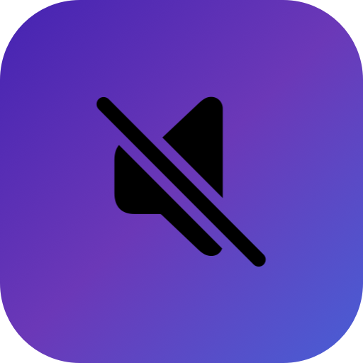
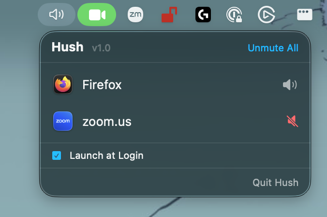

<p align="center">
  
</p>

<h1 align="center">Hush</h1>

<p align="center">
  Per-app audio mute for macOS. No drivers needed.
</p>

<p align="center">
  
  
  
</p>

---

Hush is a lightweight menu bar utility that lets you mute individual apps — something macOS doesn't offer natively. It uses Apple's [Core Audio Taps API](https://developer.apple.com/documentation/coreaudio) (introduced in macOS 14.2) instead of a virtual audio driver, so there's nothing to install beyond the app itself.



## Features

- **Per-app mute/unmute** - silence any app without affecting others
- **Live process list** - automatically detects apps producing audio
- **Output device switching** - mutes persist when you switch headphones/speakers
- **Launch at Login** - optional, via system Login Items
- **Menu bar native** - lives in the menu bar, no Dock icon
- **~500 lines of Swift** - small, auditable codebase

## Requirements

- macOS 14.2 (Sonoma) or later
- **Screen & System Audio Recording** permission (prompted on first launch)

## Install

### Download

Grab the latest `Hush.dmg` from [Releases](../../releases), open it, and drag Hush to Applications.

### Build from source

```bash
brew install xcodegen
git clone https://github.com/AYou/Hush.git  # replace with your repo URL
cd Hush
xcodegen generate
xcodebuild -scheme Hush -configuration Release build
```

The built app will be in `~/Library/Developer/Xcode/DerivedData/Hush-*/Build/Products/Release/Hush.app`.

## How it works

Hush uses the Core Audio Taps API (`AudioHardwareCreateProcessTap`) to intercept an app's audio output:

1. Creates a `CATapDescription` targeting the app's process with `muteBehavior = .muted`
2. Builds an aggregate audio device combining the tap with the default output
3. Starts a no-op IO proc to drive the aggregate device
4. The HAL silences the tapped process — other apps are unaffected

Unmuting reverses the process: stop IO, destroy aggregate device, destroy tap.

This approach requires no kernel extensions, no virtual audio drivers, and no root access. The purple dot in the menu bar while muting is Apple's system indicator for active audio taps — this is expected and cannot be suppressed.

## FAQ

**Why does a purple dot appear in the menu bar when I mute an app?**
That's Apple's system indicator for active audio taps. It appears whenever any app uses the Core Audio Taps API and cannot be hidden.

**Does Hush work with apps like Spotify, Chrome, or games?**
Yes, any app that produces audio through Core Audio (which is virtually all macOS apps).

**Can I control volume per-app, not just mute?**
Not yet. This would require intercepting the audio buffer and scaling samples, which is a planned future feature.

## License

MIT — see [LICENSE](LICENSE) for details.
